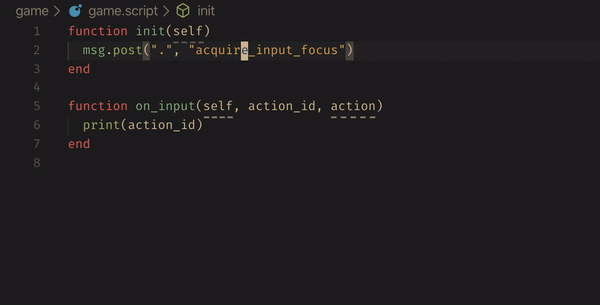

# Defold IDE

> This extension is a work in progress. It may be useful to you as it is, but it's far from a stable state and things might change.

Up-to-date autocomplete, API docs, snippets and more for the Defold game engine.

## Features

### Autocomplete and documentation

> TODO. Not implemented yet, but planned.

### Snippets

> TODO. Not implemented yet, but planned.

### Refactor hashes

Replaces strings and literal hashes with a local variables declared at the top of the file. Select or place your cursor on a hash string, then press `Ctrl+Shift+H`.

